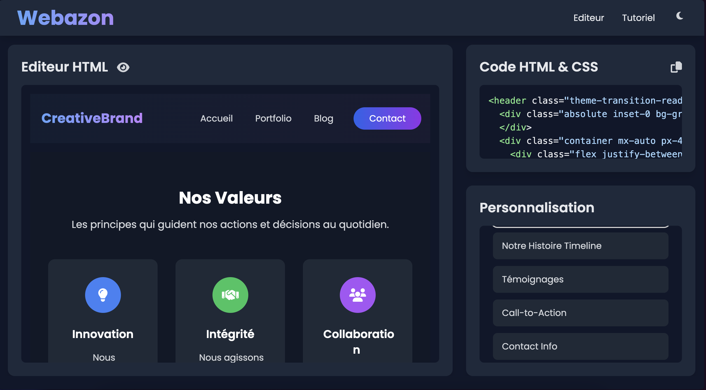

# 🎨 Webazon - Concepteur de Sites Web Frontend

[](https://github.com/securecodecreator/webazon)
[](https://github.com/securecodecreator/webazon/blob/main/LICENSE)

## 📋 Vue d'ensemble

Webazon est une application web moderne et intuitive conçue pour simplifier la création de maquettes de sites web. Elle combine la puissance de HTML5 avec l'élégance de Tailwind CSS pour offrir une expérience de conception visuelle exceptionnelle.



## ✨ Caractéristiques Principales

### 🎯 Interface Utilisateur
- **Design Moderne**: Interface épurée et intuitive
- **Responsive Design**: Adaptation parfaite à tous les écrans
- **Thèmes Personnalisables**: Modes clair et sombre intégrés
- **Prévisualisation en Direct**: Rendu en temps réel des modifications
- **Composants Drag & Drop**: Bibliothèque riche de composants réutilisables

### 🎨 Bibliothèque de Templates
- **Collection Diversifiée**: Large choix de templates prêts à l'emploi
- **Filtres Intelligents**: Recherche par catégories (Landing Pages, Portfolios, E-commerce)
- **Prévisualisation Interactive**: Aperçu détaillé avant utilisation
- **Personnalisation Facile**: Modification et adaptation rapides des templates
- **Export Flexible**: Téléchargement du code source ou édition directe dans le builder


### 🛠️ Fonctionnalités Techniques
- **Architecture Modulaire**: Structure de code organisée et maintenable
- **Performance Optimisée**: Chargement rapide et exécution fluide
- **Gestion d'État**: Système robuste de gestion des données
- **Exportation de Projets**: Sauvegarde et partage facilités
- **Validation HTML**: Vérification automatique du code généré

## 🗂️ Structure du Projet

```
Webazon/
├── LICENSE                                    # Licence MIT
├── README.md                                  # Documentation principale
├── index.html                                 # Page d'accueil
└── application/                               # Cœur de l'application
    └── public/                               # Ressources publiques
        ├── app.html                          # Application principale
        ├── model.html                        # Page des modèles
        ├── template.html                     # Page des templates
        ├── version.html                      # Page de version
        ├── css/                              # Styles CSS
        │   └── style.css                     # Styles globaux
        ├── images/                           # Ressources graphiques
        │   ├── clair.png                     # Aperçu thème clair
        │   ├── preview.png                   # Image de présentation
        │   ├── release.png                   # Image de version
        │   ├── templates.png                 # Image des templates
        │   └── sombre.png                    # Aperçu thème sombre
        └── js/                               # Scripts JavaScript
            ├── components/                    # Composants de l'application
            │   ├── customization.js          # Personnalisation
            │   ├── editor.js                 # Éditeur de code
            │   ├── preview.js                # Prévisualisation
            │   └── state.js                  # Gestion d'état
            ├── utils/                        # Utilitaires
            │   ├── dom.js                    # Manipulation DOM
            │   ├── html.js                   # Gestion HTML
            │   ├── path.js                   # Gestion chemins
            │   └── selective-copy.js         # Gestion de la copie sélective
            ├── assets.js                     # Ressources JS
            ├── models.js                     # Gestion des modèles
            ├── config.js                     # Configuration
            ├── main.js                       # Point d'entrée JS
            └── theme.js                      # Gestion thèmes
```

## 🚀 Installation

1. Clonez le repository :
```bash
git clone https://github.com/securecodecreator/webazon.git
```

2. Ouvrez le fichier `index.html` dans votre navigateur préféré
3. Commencez à créer !

## 💻 Technologies Utilisées

- **Frontend**:
  - HTML5
  - JavaScript ES6+
  - CSS3 / Tailwind CSS
  - Architecture MVC

## 🔧 Configuration

### Configuration Système
- Navigateur moderne (Chrome, Firefox, Safari, Edge)
- JavaScript activé
- Connexion Internet pour les CDN

### Personnalisation
Le fichier `config.js` permet de modifier :
```javascript
{
  theme: 'light' | 'dark',
  language: 'fr' | 'en',
  autosave: boolean,
  previewDelay: number
}
```

## 🎨 Thèmes et Styles

Webazon propose deux thèmes principaux :
- **Mode Clair**: Design épuré et professionnel
- **Mode Sombre**: Confort visuel optimal

## 🔍 Prévisualisation

Le système de prévisualisation offre :
- Rendu en temps réel
- Validation HTML5
- Responsive design testing
- Export de code propre

## 📱 Compatibilité

- **Desktop**: Chrome, Firefox, Safari, Edge
- **Mobile**: iOS Safari, Android Chrome
- **Tablette**: iPad, Android

## 🌟 Remerciements

Un grand merci à tous les contributeurs qui ont participé à faire de Webazon un outil de conception web puissant et intuitif.

---

Fait avec ❤️ par l'équipe Webazon 